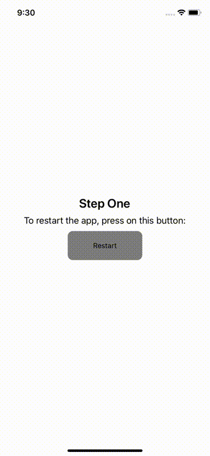
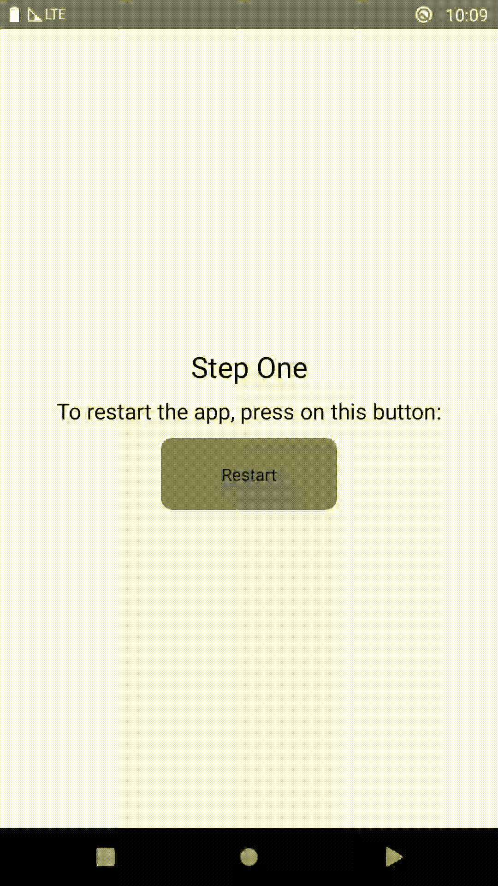

# React Native Restart

[](https://www.npmjs.com/package/react-native-restart)
[](https://www.npmjs.com/package/react-native-restart)
[](https://github.com/avishayil/react-native-restart/actions/workflows/main.yml)

Sometimes you want to reload your app bundle during app runtime. This package will allow you to do it.

iOS GIF             | Android GIF
:-------------------------:|:-------------------------:
 | 

## Installation

- Using `react-native < 0.62`? install `react-native-restart@0.0.17`
- Using `0.71 > react-native >= 0.62`? install `react-native-restart@0.0.24`
- Using `react-native >= 0.71`? install `react-native-restart@0.0.27` and above

### With `yarn`

```bash
$ yarn add react-native-restart
```

### With `npm`
```bash
$ npm install --save react-native-restart
```

## Auto-Linking Setup (react-native >= 0.60)

### iOS

```bash
$ cd ios
$ pod install
```

### Android

No further steps should be taken

## Automatic Installation (Without Auto-Linking)

`react-native link react-native-restart` or `npm install -g rnpm && rnpm link react-native-restart`

## Manual Android Installation

In `android/settings.gradle`
```gradle
...

include ':react-native-restart'
project(':react-native-restart').projectDir = new File(rootProject.projectDir, '../node_modules/react-native-restart/android')
```

In `android/app/build.gradle`

```gradle
...

dependencies {
    ...

    implementation project(':react-native-restart')
}
```

Register module (in `MainApplication.java`)

```java
import com.reactnativerestart.RestartPackage;  // <--- Import

public class MainApplication extends Application implements ReactApplication {

	private final ReactNativeHost mReactNativeHost = new ReactNativeHost(this) {
  		......

	      /**
	     * A list of packages used by the app. If the app uses additional views
	     * or modules besides the default ones, add more packages here.
	     */
	    @Override
	    protected List<ReactPackage> getPackages() {
	        ...
	        return Arrays.<ReactPackage>asList(
	                new MainReactPackage(),
	                new RestartPackage() // Add this line
	        );
	    }
	};
	......
};

```

## Manual iOS Installation

### Importing The Library

 * Drag the file `Restart.xcodeproj` from `/node_modules/react-native-restart/ios` into the `Libraries` group in the Project navigator. Ensure that `Copy items if needed` is UNCHECKED!

  

  

 * Ensure that `libRestart.a` is linked through `Link Binary With Libraries` on `Build Phases`:

  

 * Ensure that `Header Search Paths` on `Build Settings` has the path `$(SRCROOT)/../node_modules/react-native-restart` set to `recursive`:

 * You're All Set!

## CocoaPod iOS Installation

In your `ios/Podfile` make sure to use `react-native-restart` from the local
`node_modules/`. With that, only your project Pod needs to be linked and
no extra configuration is required:

```ruby
target 'MyReactApp' do
  # Make sure you're also using React-Native from ../node_modules
  pod 'React', :path => '../node_modules/react-native', :subspecs => [
    'Core',
    'RCTActionSheet',
	# ... whatever else you use
  ]
  # React-Native dependencies such as yoga:
  pod 'yoga', path: '../node_modules/react-native/ReactCommon/yoga'

  # The following line uses react-native-restart, linking with
  # the library and setting the Header Search Paths for you
  pod 'react-native-restart', :path => '../node_modules/react-native-restart'
end
```

Remember to run `cd ios && pod install` to update files used by Xcode.

## Usage

```javascript
import RNRestart from 'react-native-restart'; // Import package from node modules

// Immediately reload the React Native Bundle
RNRestart.Restart(); // Deprecated
RNRestart.restart();
```

## Contributing

Contributions are welcome. Please see [CONTRIBUTING.md](CONTRIBUTING.md) if you like to contribute to this library.

## Credits

Thanks to Microsoft CodePush library. I simply extracted the code from their library's logic to reload the React Native Bundle.
