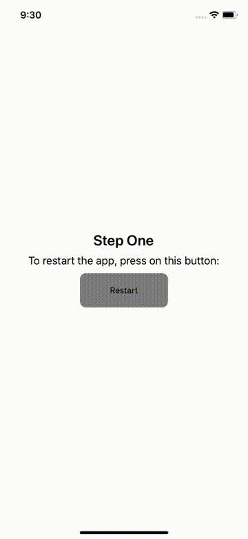
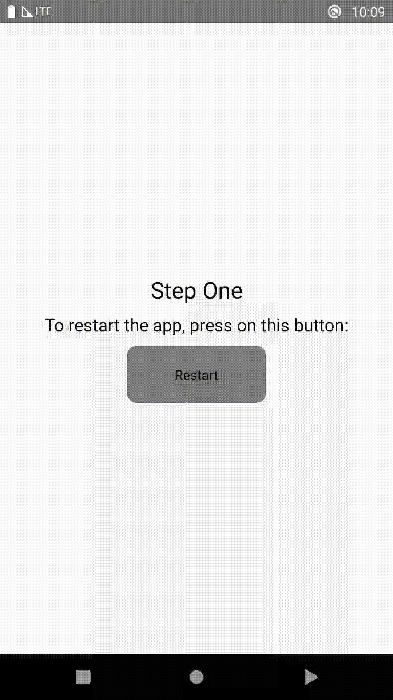

<a href="https://avishay.co.il" target="_blank" rel="noopener">
  
</a>

---

<div align="center">

# 🔄 React Native Restart

**Programmatically reload the JavaScript bundle / restart your React Native app at runtime.**

[](https://www.npmjs.com/package/react-native-restart)
[](https://www.npmjs.com/package/react-native-restart)
[](https://github.com/avishayil/react-native-restart/actions/workflows/ci.yml)
[](./LICENSE)


</div>

<table>
  <tr>
    <th align="center">iOS</th>
    <th align="center">Android</th>
  </tr>
  <tr>
    <td align="center"></td>
    <td align="center"></td>
  </tr>
</table>

Common use cases: applying an RTL/LTR locale change, recovering from a fatal JS state,
resetting the app after login/logout, or clearing in-memory state without asking the user
to kill and reopen the app.

## Features

- ✅ One call to restart — `RNRestart.restart()`
- ✅ **iOS, Android & Windows** support
- ✅ **New Architecture (TurboModule/Fabric) and legacy architecture** both supported
- ✅ Optional restart **reason** you can read back after the restart (`getReason()`)
- ✅ Fully typed (TypeScript) with a codegen TurboModule spec

## Platform & architecture support

| Platform | Restart mechanism | Old Arch | New Arch |
| --- | --- | :---: | :---: |
| iOS | Reloads the JS bundle (`RCTTriggerReloadCommandListeners`) | ✅ | ✅ |
| Android | Full process restart (`ProcessPhoenix`) | ✅ | ✅ |
| Windows | Reloads the instance (`ReactNativeHost.ReloadInstance`) | ✅ | ✅ |

> On **Android** the whole process is restarted, so native state **and** the JS runtime are
> reinitialized. On **iOS/Windows** the JS bundle is reloaded in-process. The optional restart
> reason survives the restart and is returned by `getReason()` on the next launch.

## Installation

```bash
npm install react-native-restart
# or
yarn add react-native-restart
```

Match the package version to your React Native version:

| React Native | Install |
| --- | --- |
| `>= 0.85` | `react-native-restart@latest` |
| `0.72 – 0.84` | `react-native-restart@0.0.28` |
| `0.62 – 0.71` | `react-native-restart@0.0.24` |
| `< 0.62` | `react-native-restart@0.0.17` |

**Requirements (RN 0.85+):** React 19.2+, Node 20.19+ / 22.13+ / 24.3+, iOS 15.1+ &
Xcode 16.1+, Android API 24+ (SDK 36, Java 17, Gradle 9.3+), and — for Windows —
`react-native-windows` 0.84+ (optional peer dependency).

### Linking

Autolinking (React Native ≥ 0.60) handles everything:

- **iOS:** `cd ios && pod install`
- **Android:** no extra steps
- **Windows:** `npx react-native autolink-windows` (runs automatically as part of `run-windows`)

<details>
<summary>Manual installation (legacy React Native, without autolinking)</summary>

#### Android — `android/settings.gradle`

```gradle
include ':react-native-restart'
project(':react-native-restart').projectDir = new File(rootProject.projectDir, '../node_modules/react-native-restart/android')
```

`android/app/build.gradle`:

```gradle
dependencies {
    implementation project(':react-native-restart')
}
```

Register the package in `MainApplication`:

```java
import com.reactnativerestart.RestartPackage; // <--- import

// ...in getPackages():
new RestartPackage()
```

#### iOS (manual / CocoaPods)

Add to your `ios/Podfile`:

```ruby
pod 'react-native-restart', :path => '../node_modules/react-native-restart'
```

Then `cd ios && pod install`. (For very old projects you can instead drag
`Restart.xcodeproj` from `node_modules/react-native-restart/ios` into your Xcode
`Libraries` group and link `libRestart.a`.)

</details>

## Usage

```javascript
import RNRestart from 'react-native-restart';

// Restart the app (reloads the JS bundle; full process restart on Android)
RNRestart.restart();

// Optionally attach a reason, then read it back after the restart
RNRestart.restart('language-change');
const reason = await RNRestart.getReason(); // => 'language-change'
```

### API

| Method | Description |
| --- | --- |
| `restart(reason?: string): void` | Restart the app. Preferred entry point. |
| `Restart(reason?: string): void` | **Deprecated** alias of `restart` (kept for backward compatibility). |
| `getReason(): Promise<string \| null>` | The reason passed to the last restart, or `null`. Survives the restart. |

### White screen during restart

Because `restart()` tears down the view hierarchy and remounts the app, there is a brief gap
before the new instance renders — on iOS this can look like a white flash. To avoid it, set
your root view's background color natively in `AppDelegate`:

```objc
- (UIView *)createRootViewWithBridge:(RCTBridge *)bridge
                          moduleName:(NSString *)moduleName
                           initProps:(NSDictionary *)initProps {
  UIView *rootView = [super createRootViewWithBridge:bridge moduleName:moduleName initProps:initProps];
  rootView.backgroundColor = [UIColor blackColor]; // your app's background color
  return rootView;
}
```

A full splash screen for the duration of the restart needs additional app-side native code
(a native launch screen shown on app launch). See
[#238](https://github.com/avishayil/react-native-restart/issues/238).

## Architecture

A thin JS bridge (`src/index.tsx` + the TurboModule spec `src/NativeRNRestart.ts`) over native
`RNRestart` modules on iOS (`ios/`), Android (`android/`), and Windows (`windows/`). Any
public-API change must be made across the JS layer and every native platform together. For a
full overview of structure, commands, build/publish flow, and conventions — for contributors
and AI agents — see [CLAUDE.md](CLAUDE.md).

## Testing

The library is tested across JS, native iOS, native Android, and end-to-end (Maestro), with
each layer exercising the full restart/refresh flow. See [TESTING.md](TESTING.md) for exactly
what runs where and how to run it.

## Security

Please report vulnerabilities privately — see [SECURITY.md](SECURITY.md).

## Contributing

Contributions are welcome — see [CONTRIBUTING.md](CONTRIBUTING.md).

## Credits

Thanks to the Microsoft CodePush library; the original bundle-reload logic was extracted from
there.

## License

[MIT](./LICENSE)
